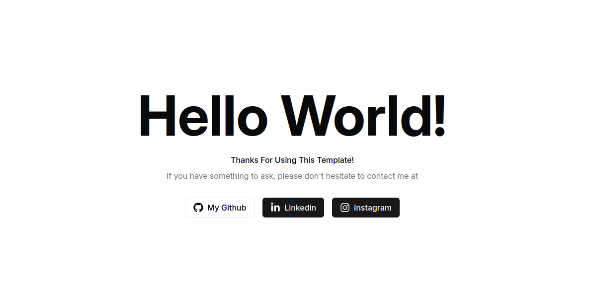

# React + TS + Redux + Template

Built with the React.js, TypeScript, Redux, RTK Query, React Router Dom, Shadcn UI



## Features

- React.js
- TypeScript
- Redux Toolkit
- RTK Query
- React Router Dom
- Shadcn UI
- Handling Error Pages & Structured Pattern

## Getting started

To get started with this project, run

```bash
  git clone https://github.com/ariefhk/react-ts-redux-template
```

Install Dependency

```bash
  pnpm i
```

and copy the .env.example variables into a separate .env file, fill them out.

Run in Development

```bash
  pnpm dev
```

That's All, Happy Coding :D

## License

[MIT](https://choosealicense.com/licenses/mit/)
